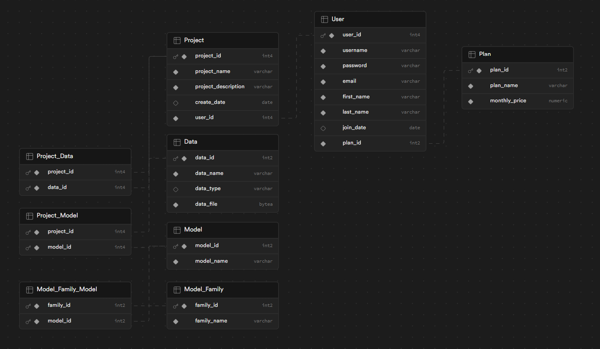

# natural-language-db
Exploratory, work-in-progress project to extract information from an SQLite database with natural language queries. Users can ask questions of the database and the questions are then converted into a SQL query by an LLM. The query is then executed on the database and results are returned the the LLM. The LLM with then use the query results to answer the original question with natural language.

## Quickstart

To query the database:

`python3 run.py "{your natural language query}"`

## Notes

`run.py` will automatically create and populate a sample database if it has not already been created. The database location can be changed in `constants.py`. 

## Default database

`run.py` will automatically create and populate a sample database if it has not already been created. The database location can be changed in `constants.py`. 

This database represents the backend of a machine learning application where users can create projects, upload data to their projects, and fit machine learning models to the data.

The sample database schema is:

